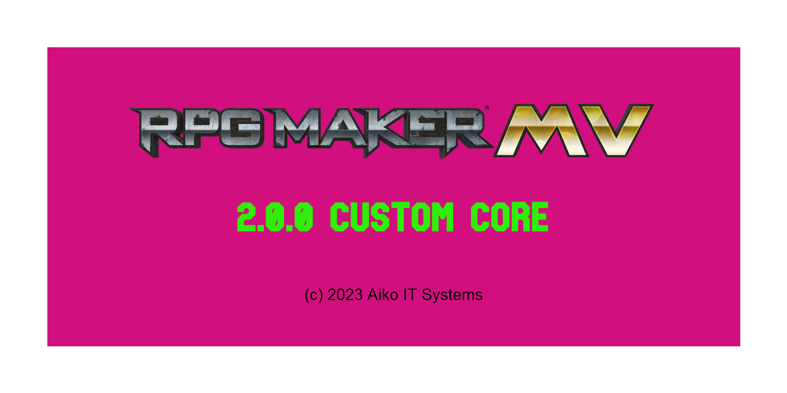

# RPG Maker MV Custom Core

This is a custom core for RPG Maker MV. It is based on the default core, but with some changes.

> :warning: This core is WIP

## Backstory

We are currently working on the game [Traveler](https://traveler-rpg.dev).
It uses [RPG Maker MV](https://rpgmakerofficial.com/product/mv/) which isn't updated/maintained anymore since a few years.

It contains a lot of bugs and some features are missing. Some stuff looks pretty ugly (like error messages).
So we started rewriting the core.

Some people came and asked whether we can provide our rewritten core to them.
So here we are.

## Version Overview

| Name         | Version                                                        |
| ------------ | -------------------------------------------------------------- |
| RPG Core     | v2.0.0 ([source](src/js/rpg_core/))                            |
| RPG Managers | v2.0.0 ([source](src/js/rpg_managers/))                        |
| RPG Objects  | v2.0.0 ([source](src/js/rpg_objecs/))                          |
| RPG Scenes   | v2.0.0 ([source](src/js/rpg_scenes/))                          |
| RPG Sprites  | v2.0.0 ([source](src/js/rpg_sprites/))                         |
| RPG Windows  | v2.0.0 ([source](src/js/rpg_windows/))                         |
| Pixi.js      | [v4.5.6](https://github.com/pixijs/pixijs/releases/tag/v4.5.6) |
| FPSMeter     | v0.3.1                                                         |

## Installation

### Installation for RPG Maker MV

1. Download `rmmv-core.zip` from the [latest release](https://github.com/Aiko-IT-Systems/rmmv-core/releases/latest)
2. Extract the zip file
3. Copy the content of the `rmmv-core` folder into the `NewData` folder into your RPG Maker MV installation
4. Start RPG Maker MV and create a new project

### Installation for existing projects

1. Download `rmmv-core.zip` from the [latest release](https://github.com/Aiko-IT-Systems/rmmv-core/releases/latest)
2. Extract the zip file
3. Copy the contents of the `rmmv-core` folder into your project
4. Replace the `<title></title>` tag in the `index.html` with your game title
5. Replace `name` & `title` with your game title and `description` with your game description in the `package.json` file

## Changes

TODO